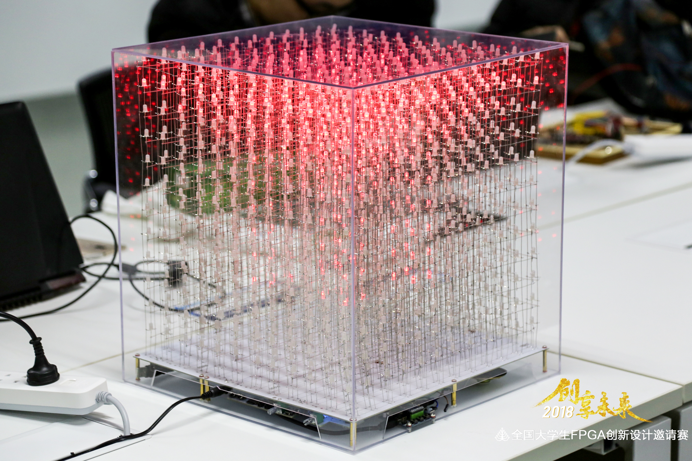
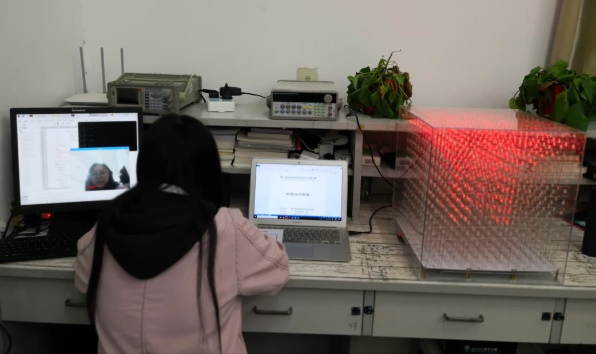
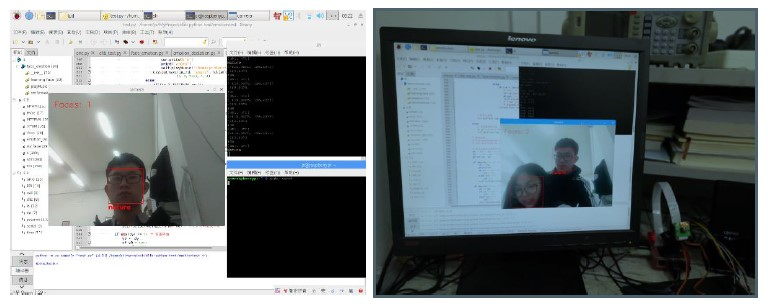
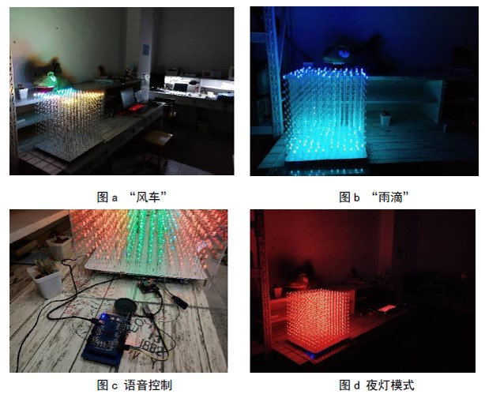
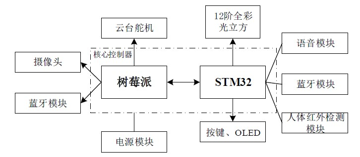
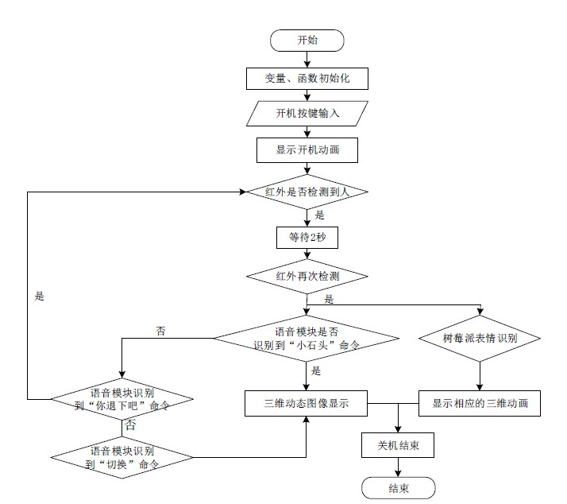

# EmotionCube 💠 <br> Intelligent Speech Companion Robot Based-on Sentiment Analysis

<p align="left">
  <a href="https://github.com/Charmve"></a>
  <a href="https://www.zhihu.com/people/MaiweiE-com" target="_blank" ></a>
  <a href="https://www.bilibili.com/video/BV1i7411u7CG/" target="_blank"></a>
  <a href="https://imgconvert.csdnimg.cn/aHR0cHM6Ly9tbWJpei5xcGljLmNuL21tYml6X3BuZy9aTmRoV05pYjNJUkIzZk5ldWVGZEQ4YnZ4cXlzbXRtRktUTGdFSXZOMUdnTHhDNXV0Y1VBZVJ0T0lJa0hTZTVnVGowamVtZUVOQTJJMHhiU0xjQ3VrVVEvNjQw?x-oss-process=image/format,png" target="_blank" ></a>
  <a href="./03_Docs/基于情绪分析的语音陪伴机器人_创意设计报告.pdf" target="_blank"></a>
</p>
<br>

Taking emotion analysis and intelligent speech as the research object, in order to improve the current situation of intelligent furniture robot <b>lack of emotional interaction</b>, an intelligent companion robot is designed based on <b>expression recognition</b> and <b>intelligent speech</b>. The system mainly includes an expression recognition camera, an intelligent voice module, and a full color light cube display system. After actual testing, the system has fast response, high recognition accuracy, stable work, and a good experience, making people's lives more intelligent and user-friendly.

- <p><b>Expression Recognition Camera</b>: RasberryPi 3B+, CameraPi </p>
- <p><b>Intelligent Voice Module</b>: intelligent speech based on FPGA, Microphone</p>
- <p><b>Full-color Light-cube Display System</b>: Including power switch circuit, control circuit and cascade drive circuit, and leave enough space to expand subsequent circuits.Especially, this display system come from my another projects: <a href="https://github.com/Charmve/LightCube-A-Design-of-3D-Dynamic-Display-System-Based-on-Voice-Control" target="_blank">LightCube - A Design of 3D Dynamic Display System Based-on Voice Control</a></p>

<div align=center></div>
<p align="center"><b>Emotion Cube</b></p>

## Oritation/Application
Function positioning of companion robot:
- <b>Home entertainment</b> The smart speakers equipped with technology terminals such as voice recognition and microphone make the companion robot more humane and improve the happiness of life;
- <b>Popular science education</b> The full-color light cube animation stimulates children's imagination of three-dimensional space, their interest in intelligent technology, and spreads knowledge of three-dimensional modeling;
- <b>Emotional complement</b>
According to the results of sentiment analysis, Light Cube uses different melody music and animations to express their feelings
Love makes interaction more lively and interesting and heals emotions.

## Insights

Human-computer interaction that can produce emotional interaction with people is the real meaning of smart home. This work takes emotion analysis and intelligent speech as the research object, adopts comprehensive designs such as full-color light cube three-dimensional animation, facial expression recognition, voice recognition, etc., allowing technology to resonate with human emotions, alleviating people's life pressure, emotional healing, and creating a warm and comfortable Emotional home
surroundings. Specifically in:

1. Improve <b>the single function</b> of traditional companion robots and <b>lack of emotional communication</b>;

2. The integration of dynamic expression recognition and naked-eye 3D display technology has brought new opportunities for emotional communication in the field of smart home, and also proposed a new direction of smart home, <b>emotional interaction</b>.

3. Comprehensive evaluation of multiple emotions can obtain a person's true emotional state, which is more beneficial to regulate emotions and relieve stress.

4. The display effect of three-dimensional animation can bring people a real visual enjoyment, and the naked-eye 3D sensory experience can satisfy people's capture and enrichment of the picture.

5. The cascaded drive circuit design of the high-end full-color light cube solves the problem of LED drive with a current that is difficult to meet the number of tens of thousands. This design solution can be used to meet a larger number of three-dimensional dot matrix displays.


## How's it going?

### 1. Dynamic expression recognition

To put it simply, facial expressions are part of the human body's (physical) language, which is a physical and psychological response, usually used to convey emotions. There are many kinds of human facial expressions. At present, the recognition of the six basic human expressions of happiness, surprise, sadness, anger, disgust and fear is relatively good. Facial expressions can be recognized better, and signs and commands are given to control people. The machine interactive device completes the corresponding action. Due to the complexity of human emotions, these expressions are not enough to fully determine the emotional fluctuations in a person's heart. To improve the accuracy of judgment, it is necessary to pass comprehensive evaluations such as heart rate detection and voice processing.

<div align=center></div>
<p align="center"><b>Figure 1</b>. The effect of facial expression recognition</p>

### 2. Voice Control Realization

Speech recognition is realized by LDV5 speech module and FPGA speech sampling, filtering and recognition. After a long period of debugging and parameter setting, the recognition rate of commonly used sentences is high, and the voice chat function is completed through local semantic analysis and retrieval. Functions such as intelligent voice answering, light music playback, storytelling, and voice-controlled light cube display are now relatively complete, but the voice recognition rate needs to be improved, and the response time needs to be reduced.

### 3. Full-color Cube Display
<a href="https://youtu.be/5ZROSW0DQC4"></a>

<div align=center></div>
<p align="center"> <b>Figure 2</b>. 3D dynamic display effect diagram of light cube 12*12*12</p>

### 4. Overall Realization

After the Raspberry Pi is powered on, turn on the camera to perform dynamic expression recognition. When facial expressions are recognized, background music to adjust emotions is played. At the same time, send instructions to STM32 through Bluetooth communication to control the light cube to display different three-dimensional animations, and cooperate with the playing background music to create a relaxed, comfortable and warm home environment, which can effectively relieve people's mental stress and relieve emotions.

<div align=center></div>
<p align="center"> <b>Figure 3</b>. 3D dynamic display effect diagram of light cube 12*12*12</p>

## How to do it?
### 1. Overall System Block

As shown in Figure 4, the robot system consists of Raspberry Pi and STM32 as the main controller, and sends the expression recognition result to STM32 to control the light cube to display 3D full-color animation. The Raspberry Pi completes the control of the pan/tilt steering gear so that the camera can track the movement of people; Dlib and Numpy are used for face recognition, facial feature point extraction and algorithm normalization processing to complete facial expression recognition. STM32F4 controls the LED lights of the three-dimensional position of the 12-level full-color light cube to display full-color animation, presenting a 3D picture, and enhancing the visual effect. (Refer to Figure 5 for the specific implementation process)

<div align=center></div>
<p align="center"> <b>Figure 4</b>. System Block</p>

<div align=center></div>
<p align="center"> <b>Figure 5</b>.  Program Flow Chat</p>
  
  
### 2. Dynamic Expression Recognition
  
First, use dlib to complete face recognition, and extract 68 feature points of face information. Then instantiate a shape_predictor object, use dlib to train face feature detection, and perform face feature point calibration. When calibrating, use the circle method of opencv to add a watermark to the coordinates of the feature point. The content is the serial number and position of the feature point. Next, it is necessary to perform a comprehensive calculation based on the coordinate information of these 68 feature points as a judgment index for each expression.

According to the judgment index we put forward, first calculate the proportion of mouth open. Before selecting the standard value of the indicator, analyze multiple happy face photos and calculate the average of the ratio of open mouth when happy. Use the slope of the fitted straight line to approximate the degree of inclination of the eyebrows. Similarly, calculate the eyebrow height and mouth width of each expression, and then classify and discuss, and give the discrimination threshold. Through the analysis of multiple different expression data, the reference value of each index can be obtained, and simple expression classification standards can be written to complete expression recognition.
  
### 3. Smart Voice

For audio signal processing, we use the LDV5 module for processing. FPGA simulates SPI to communicate with the module to read the value of its register, and perform FFT fast Fourier transform on it for voice signal processing, and send corresponding instructions through the voice signal. FPGA voice sampling, filtering, and recognition, after a long period of debugging and parameter setting, the recognition rate of commonly used sentences is high, and the voice chat function is completed through local semantic analysis and retrieval.

### 4. Full-color Light-Cube

Adopt 12 SM16126 serial conversion and strong drive chip cascade to form 144 output port control, input timing control through DateIN data port, carry out PWM modulation, produce RBG color adjustment. Through the host computer of the light cube 3D modeling we designed, we design different animations, mark the 6-bit data of each LED, etc., and finally read each frame of animation of the 12-level light cube in the SD card in DMA mode Realize the full-color animation display of Light Cube.

<div align=center></div>

<br>
Go to the ``.doc/.pdf`` file in Chinese,click <a href="https://github.com/Charmve/Intelligent-Speech-Sompanion-Robot-Based-on-Sentiment-Analysis/tree/master/03_Docs" target="_blank">here</a>

<br>

## Acknowledgements

<p> Here, I would like to thank my partner: Shen Fuzhou, who has been with me to continue this project, and he has also contributed a lot to this project. I am honored to meet such a great partner in college. At the same time, I would also like to thank my instructor: Mr. Chen Lei, who provided us with guidance and financial support from the school. Without your help, this project cannot be successfully completed. PS: The whole project took half a year, and it took more than 20 days to weld the entire light cube -_- (Here, I have to thank my roommates, specially Sun Jiqiao, for welding with us!)</p>


## Notification

<p> Because this project is a funded project, on the one hand, it is open source for public welfare, and on the other hand, it has applied for <a href="https://github.com/Charmve/Intelligent-Speech-Sompanion-Robot-Based-on-Sentiment-Analysis/tree/master/04_Licences" target="_blank">national patents protection 📑</a> for copyright ownership. If you have any commercial use, please contact me.</p>

If you have any questions or idea, please let me know :email: yidazhang1@gmail.com

## Citation
Use this bibtex to cite this repository:
```
@misc{EmotionCube,
  title={Emotion Cube: Intelligent Speech Companion Robot Based-on Sentiment Analysis},
  author={Charmve},
  year={2019.12},
  publisher={Github},
  journal={GitHub repository},
  howpublished={\url{https://github.com/Charmve/Intelligent-Speech-Sompanion-Robot-Based-on-Sentiment-Analysis}},
}
```

## 🚧 **My Related Work: ⬇️**

&nbsp;&nbsp;&nbsp;&nbsp;&nbsp; [](https://github.com/Charmve/LightCube) &nbsp;&nbsp;&nbsp;&nbsp;&nbsp;[](https://github.com/Charmve/Practicum4ECE)

## :heart: Follow me or Sponsor me

> You can find how to contact me in the right sidebar. You can follow me to find something more interesting.

If you like ~~Charmve or me~~ or my projects, you can buy me a ☕ coffee 🍉 / 🍦 or 🍰 cake at [Charmve Sponsors](https://charmve.github.io/sponsor.html) to support me, click the button. Your name will be shown at [https://charmve.github.io/sponsor.html](https://charmve.github.io/sponsor.html).

<!--START_SECTION:sponsors-->
<a href="https://charmve.github.io/sponsor.html" target="_blank"></a>

<br>

---

Code with :heart: & :coffee: By Charmve @ 2021
